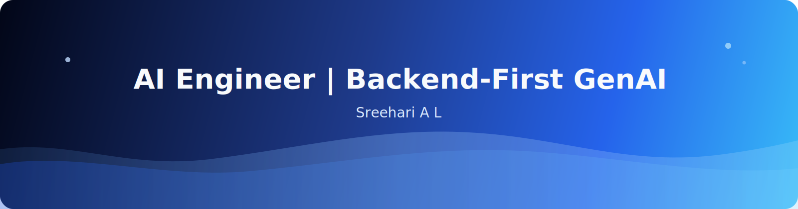

<h1 align="center">Sreehari A L</h1>

  

<h1 align="center">Hi, I'm Sreehari 👋</h1>

  <b>AI Engineer</b> — I turn LLMs into dependable backend services: 
  typed APIs, retrieval that cites its sources, and guardrails that don't trust model output.

  
  
  

🔭 <b>AI Engineer Intern @ Tecnots</b> · Bengaluru

---

## 🚀 Featured projects

| Project | What it is | What it proves |
|---|---|---|
| **[grounded](https://github.com/SR33H4R1/grounded)** | Role-aware **RAG with cited answers** — FastAPI + FAISS + OpenAI-compatible LLM | retrieval, embeddings, access-control gating |
| **[querymind](https://github.com/SR33H4R1/querymind)** | Natural language → **safe, read-only PostgreSQL** queries | LLM orchestration + multi-layer SQL guardrails |
| **[bookstore-api](https://github.com/SR33H4R1/bookstore-api)** | Async FastAPI — **hand-rolled JWT auth, RBAC, Alembic** | production backend depth |

## 🛠️ Tech

  
  
  
  
  
  
  
  
  
  

## 📈 GitHub

  
  

## 🌱 Currently going deeper on
Agentic workflows (LangGraph, tool/function calling, MCP), RAG evaluation, and deployment.

## 📫 Reach me
[Portfolio](https://sreeharial.me) · [LinkedIn](https://www.linkedin.com/in/sreehari-a-l) · sreehariarun191@gmail.com
